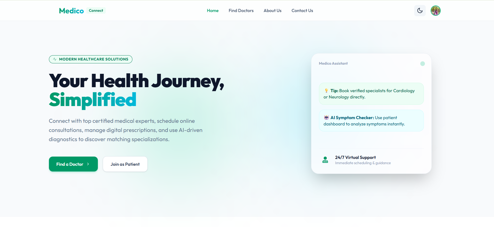
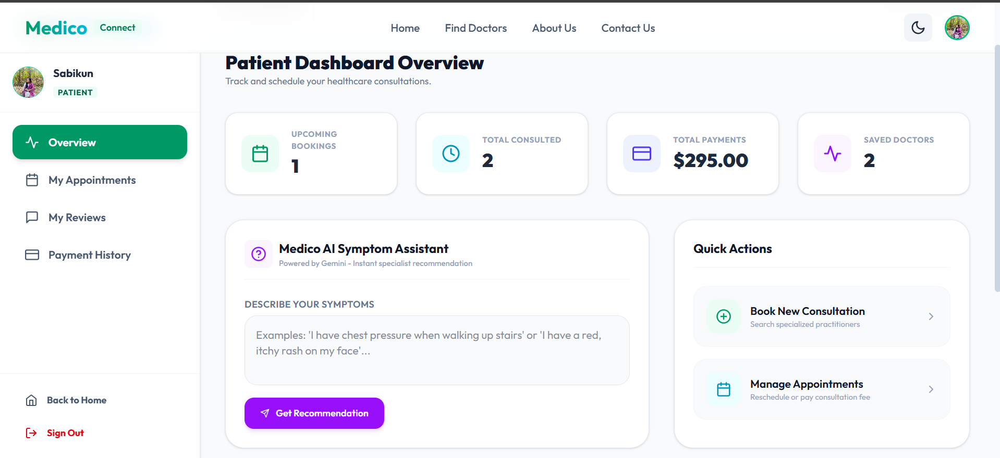
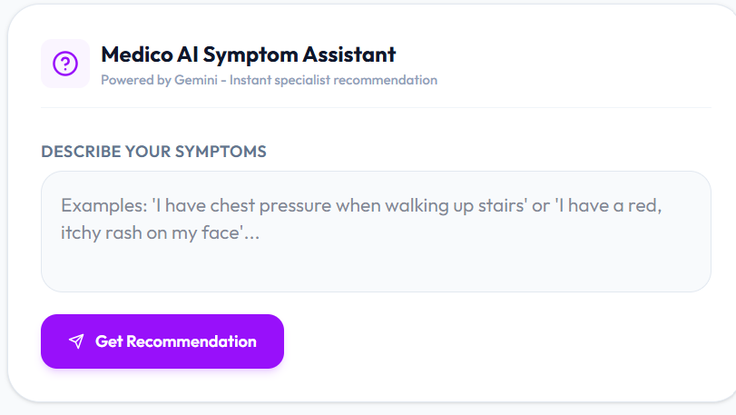
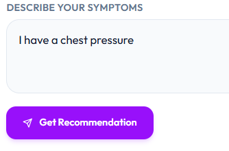
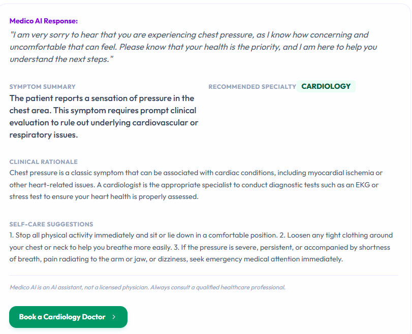

# Medico Connect 🏥

A premium, state-of-the-art medical consultation platform bridging the gap between patients and doctors. Medico Connect offers seamless appointment booking, a comprehensive role-based dashboard (Admin, Doctor, Patient), secure Stripe payments, and an intelligent AI Medical Assistant for preliminary health insights.

### 🌐 [Live Demo](https://medico-client-ochre.vercel.app/)

---

## ✨ Features

- **Role-Based Workspaces**: Dedicated dashboards for Patients, Doctors, and Admins.
- **Doctor Discovery**: Browse doctors by specialization, rating, experience, and consultation fees.
- **Smart Scheduling**: Patients can easily book time slots based on the doctor's real-time availability.
- **Secure Payments**: Integrated with Stripe for seamless, secure checkout for consultations.
- **AI Medical Assistant**: An intelligent chatbot that helps patients identify symptoms and recommends relevant medical specialties before they book a consultation.
- **Secure Authentication**: Custom Cross-Domain Bearer Token Authentication powered by Better Auth.
- **Modern UI/UX**: Dark mode support, glassmorphism, responsive design, and smooth micro-animations.

---

## 📸 Platform Highlights

### The Home Page
A welcoming, dynamic interface guiding patients to find the right doctors. It features quick search bars, top-rated doctor highlights, and immediate access to the AI Medical Assistant.



### AI Medical Assistant
Our embedded AI Assistant analyzes patient symptoms in real-time. It asks follow-up questions to understand the condition and ultimately recommends the correct doctor specialization to consult (e.g., Neurologist, Cardiologist), saving time and ensuring patients get the right care.

<div style="display: flex; gap: 10px; margin-bottom: 10px;">
  
  
</div>
<div style="display: flex; gap: 10px;">
  
  
</div>

---

## 🛠️ Technology Stack

**Frontend:**
- [Next.js](https://nextjs.org/) (App Router)
- [React](https://reactjs.org/)
- [Tailwind CSS](https://tailwindcss.com/)
- [Framer Motion](https://www.framer.com/motion/) (Animations)

**Backend:**
- [Node.js](https://nodejs.org/) & [Express](https://expressjs.com/)
- [MongoDB](https://www.mongodb.com/)
- [Better Auth](https://better-auth.com/) (Custom Bearer Implementation)
- [Stripe](https://stripe.com/) (Payments)
- [Gemini AI](https://deepmind.google/technologies/gemini/) (AI Medical Assistant Engine)

---

## 🚀 Running Locally

### Prerequisites
- Node.js (v18+)
- MongoDB connection string
- Stripe API Keys
- Gemini API Key

### Installation

1. **Clone the repository**
   ```bash
   git clone https://github.com/yourusername/Medico-client.git
   cd Medico-client
   ```

2. **Install dependencies**
   ```bash
   npm install
   ```

3. **Set up Environment Variables**
   Create a `.env.local` file in the root directory:
   ```env
   NEXT_PUBLIC_API_URL=http://localhost:5000
   ```
   *(Note: Set up the backend server separately to ensure full functionality).*

4. **Run the development server**
   ```bash
   npm run dev
   ```

5. Open [http://localhost:3000](http://localhost:3000) in your browser.

---

## 🛡️ Authentication Architecture
This project utilizes a highly robust, cross-domain authentication strategy. To solve browser restrictions on third-party cookies across different subdomains, the backend validates native `Authorization: Bearer <token>` headers, dynamically fetching the session from MongoDB and injecting it into the global React state for instantaneous UI updates.

---

*Designed & Developed with ❤️ for better healthcare accessibility.*
